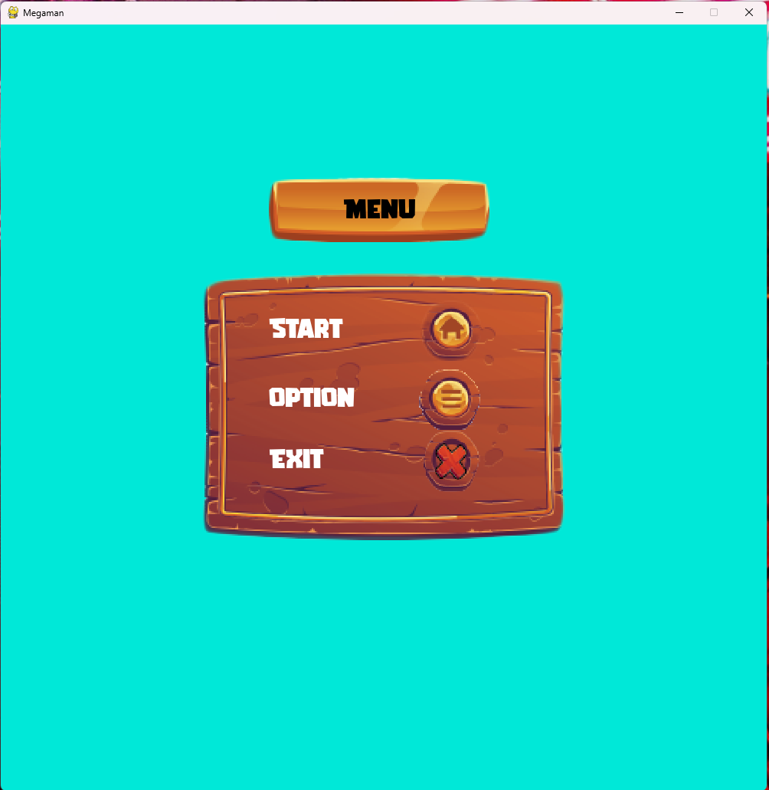
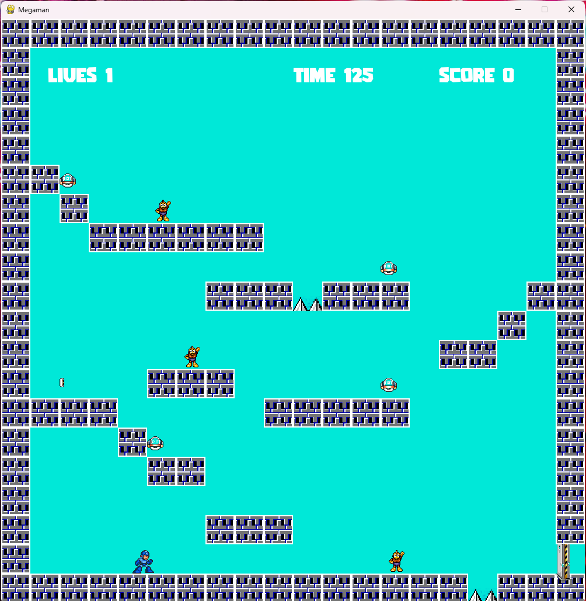
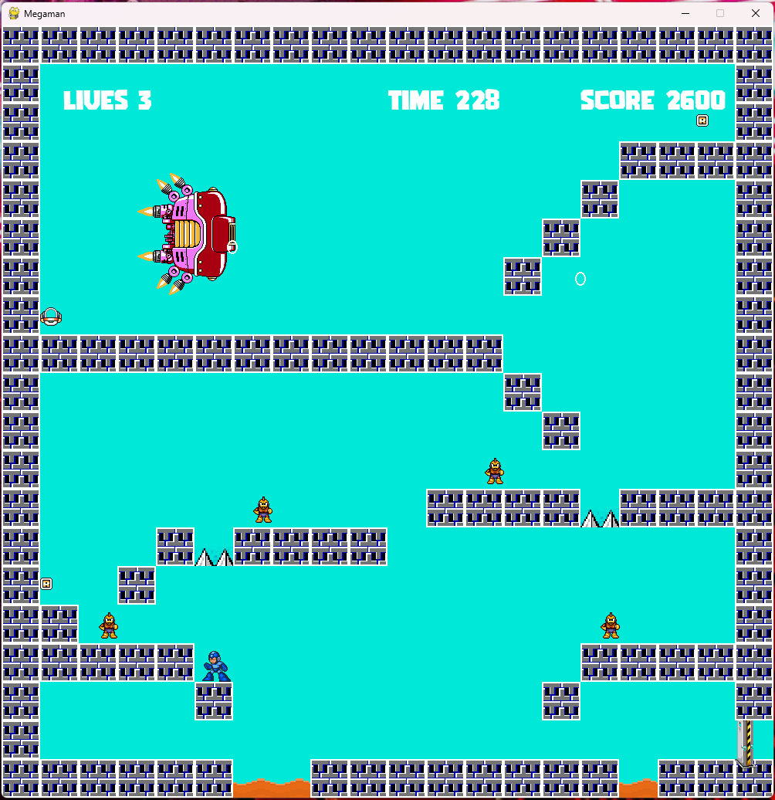
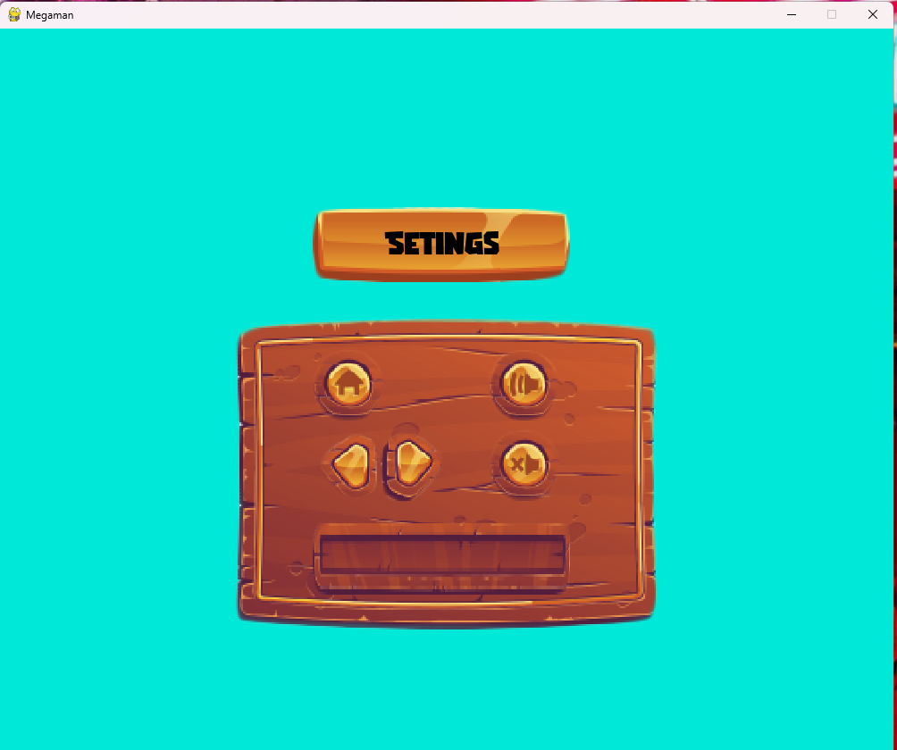

# Megaman.

## Desarrollado por: 
- Diego Uthurburu

## Proyecto: Un videojuego desarrollado en Python.

## Descripción
¡Bienvenido a MegaPython, una emocionante odisea retro con un giro de serpiente pitón! Este proyecto, inspirado en los clásicos juegos de Mega Man, ha sido meticulosamente desarrollado en Python utilizando el poderoso módulo Pygame y sigue la tradición de los juegos de plataformas de la vieja escuela.

## Objetivo: 
Enciende las Lámparas: Para avanzar de nivel, el jugador deberá encender lámparas estratégicamente ubicadas. Prepárate para explorar cada rincón de los niveles para activar las lámparas y desbloquear nuevos desafíos.

## Menú de Opciones Intuitivo: 
Personaliza tu experiencia desde el principio con nuestro menú de opciones intuitivo. Ajusta la configuración a tu gusto antes de sumergirte en la acción.

## Controles de Sonido: 
Mantén el control total de la experiencia auditiva con un sistema que te permite ajustar los efectos y la música en cualquier momento del juego. ¡Crea la banda sonora perfecta para tu propia aventura!

## Desarrollo Orientado a Objetos:
 Con un enfoque sólido en la programación orientada a objetos, el código de MegaPython es modular y fácil de entender. Explora el código fuente y personaliza el juego según tus preferencias.

- Diego Uthurburu [ver Video en Youtube.](https://youtu.be/IoHzpeddSiM)

## Capturas:

## Nivel final.

## Menu opciones:

---
### Fuentes
- [Consejos para documentar](https://www.sohamkamani.com/how-to-write-good-documentation/#architecture-documentation).

- [Lenguaje Markdown](https://markdown.es/sintaxis-markdown/#linkauto).

- [Markdown Cheatsheet](https://github.com/adam-p/markdown-here/wiki/Markdown-Cheatsheet).

- [Tutorial](https://www.youtube.com/watch?v=oxaH9CFpeEE).

- [Emojis](https://gist.github.com/rxaviers/7360908).

---
